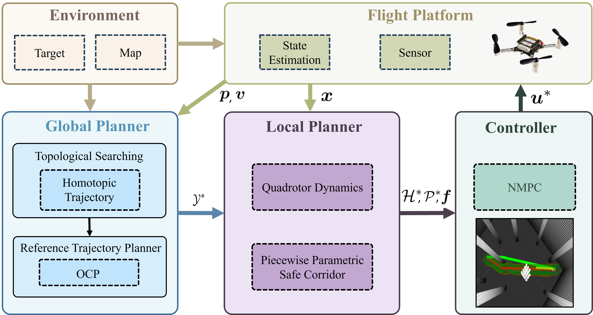

# CORTO-Planner
Code Release for RA-L 2026

**Related Paper:**

- Corridor-Driven Topological Planning with Nonlinear MPC for Agile Quadrotor Flight
- Authors: Honghao Pan, Hang Wang, Farshad Arvin, Junyan Hu
- [Video](https://youtu.be/e6qSrI7WdOc)

<p align="center">
  
  
</p>

## Abstract
In this paper, we present a corridor-driven topological planning and control framework for agile quadrotor flight. To achieve this goal, a topological search generates multiple homotopy distinct reference paths, and a time optimal problem allocates execution time to provide high quality initialisation. Then, we propose a piecewise parametric safe corridor, consisting of off-centred elliptical cross sections whose parameters vary smoothly with the path. Additionally, we develop an efficient reformulation for real-time computation while preserving continuity. Based on this corridor representation, a nonlinear model predictive controller tracks the optimal reference trajectory and enforces corridor and dynamic constraints. 

<p align="center">
  
</p>

<p align="center">
  
</p>

## Installation
The project is developed on Ubuntu 20.04 (ROS Noetic). 

**Dependencies**
```sh
sudo apt install libeigen3-dev libnlopt-dev libpcl-dev
```

**MOSEK** is required for this work. Please install MOSEK and configure:
```sh
export MOSEK_ROOT=~/mosek/your_version
```

## Quick Start
We provide a demo launch file for quick start at simulation.

```bash
git clone https://github.com/yzpd/CORTO-Planner.git
cd CORTO-Planner
catkin_make
source devel/setup.bash
roslaunch planner planner.launch
```